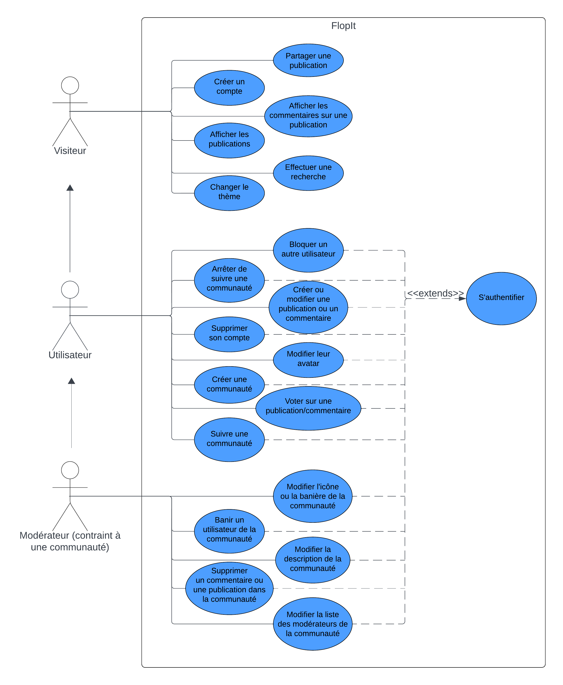
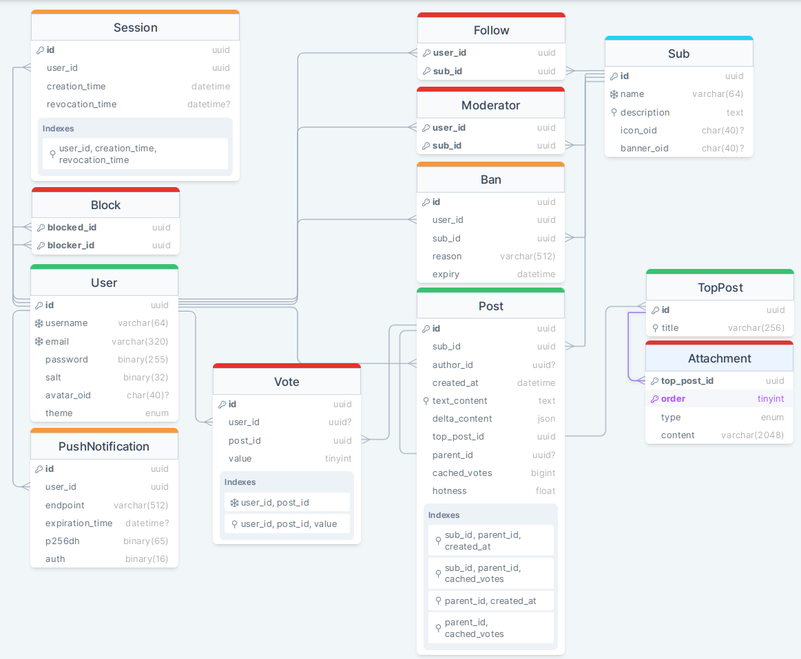
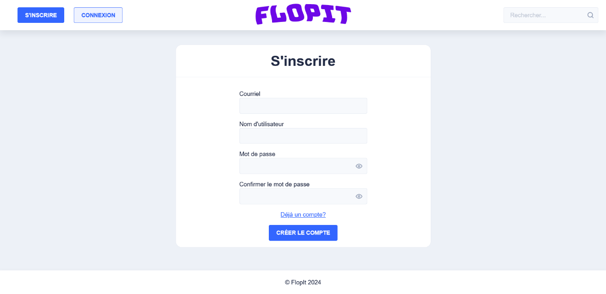
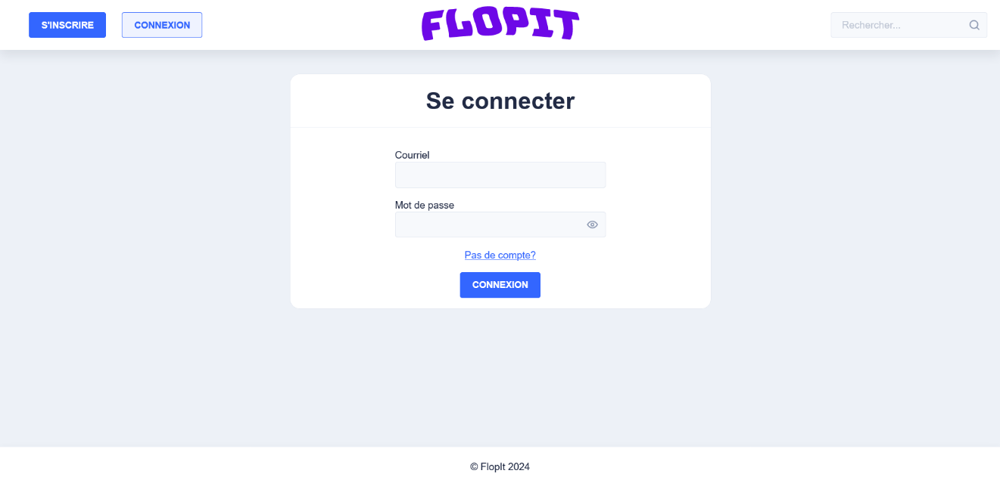
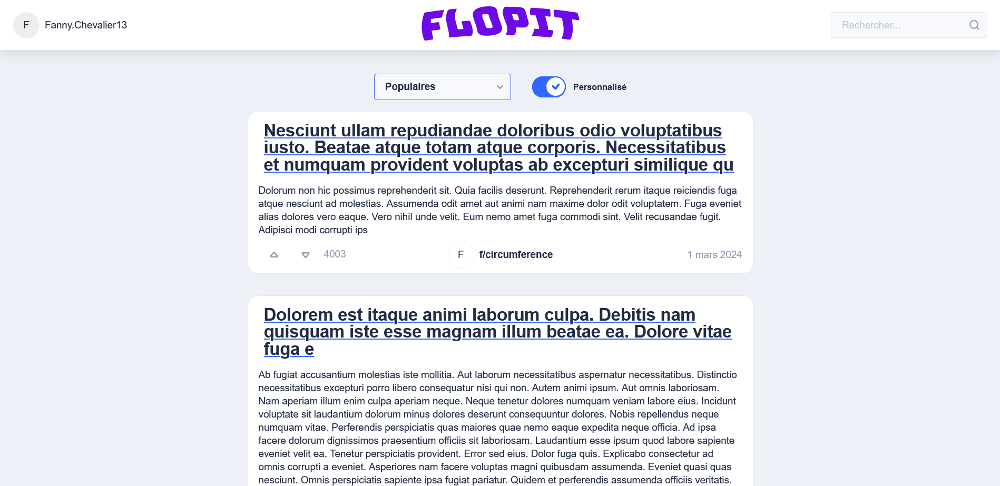
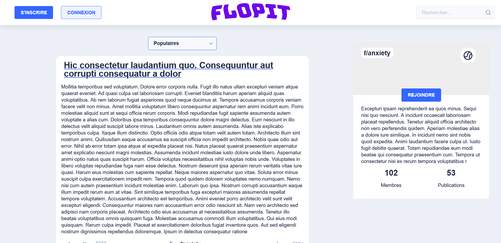

#  Description du projet

## Description

FlopIt est, essentiellement, un réseau social où les utilisateurs
peuvent, dans des communautés publiques, créer des publications sous
lesquelles ils peuvent ajouter des commentaires. Ils peuvent aussi voter
de façon positive ou négative sur les publications et les commentaires.
FlopIt contient un système de messagerie dans lequel les utilisateurs
pourront communiquer entre eux. FlopIt vient faire directement
compétition avec la plateforme Reddit qui a fait au cours de l'année
dernière des changements qui ont été très mal reçus par les
utilisateurs. Ainsi, il devrait être possible de débaucher ces
utilisateurs pour qu'ils utilisent la plateforme FlopIt. FlopIt sera
monétisé avec des annonces publicitaires (NOTE : ce système reste hors
porté pour le prototype initial). Nous espérons que vous serez satisfait
de notre évaluation de vos besoins.

## Portée

### Flux d’accueil

Les utilisateurs seront accueillis par leur flux d'accueil (homefeed) où
ils verront les publications des communautés qu’ils suivent. À partir de
là, ils peuvent voter de façon positive ou négative, commenter, ou
partager une publication. Toutes ces options sont disponibles sous les
publications.

### Création de publication

Les utilisateurs peuvent créer une publication sur laquelle ils peuvent
ajouter des titres, du texte, des images, etc. C’est aussi là où
l’utilisateur choisit la communauté dans laquelle publier.

### Chat

Cette fonction permet aux utilisateurs de s’envoyer des messages entre
eux. Il est possible de bloquer un utilisateur, l’empêchant ainsi de
nous contacter.

## Hors portée

-   FlopIt ne permet pas de trier les articles par autre chose que la
    date, le nombre de votes ou la popularité.

-   FlopIt ne permet pas d’attacher des fichiers autres que des images
    ou des vidéos à une publication.

-   FlopIt ne permet pas de créer des groupes de conversation chat avec
    plusieurs Utilisateurs.

-   FlopIt ne permet pas le partage de fichiers dans les commentaires
    (autre qu’avec un lien vers).

-   FlopIt ne permet pas de faire une communauté privée.

-   FlopIt ne permet pas de filtrer les publications par autre chose que
    la communauté dans laquelle ils ont été publiés.

-   FlopIt ne permet pas de « tagger » des publications.

-   FlopIt ne contient pas de fonctionnalités reliées aux
    « blockchains ».

-   FlopIt ne permet pas de limiter les permissions d’un modérateur.

-   FlopIt ne contiendra pas de bouton pour signaler du contenu.

-   FlopIt ne contiendra pas d’intégration pour se créer un compte ou se
    connecter en utilisant des tiers partis.

# Méthodologie de travail en équipe

## Outils

Le projet est entièrement stocké sur *GitHub* ; la liste des tâches est
aussi stockée sur GitHub en utilisant la fonctionnalité « projects ».

Notre équipe utilise la fonctionnalité « ruleset » de *GitHub* pour
enforcer certaines règles de travail d'équipe comme l'obligation
d'utiliser des branches, des « pull requests » et de demander à
coéquipier de réviser son code avant de « merge » dans main.

Le projet est configuré pour les IDEs *Jetbrains* et *Microsoft Visual
Sudio Code*. Cependant, puisque 3 des 4 membres de l'équipe utilisent
*IntelliJ*, le projet est plus facile à ouvrir et utiliser sur cet IDE.

Notre équipe utilise la plateforme *Discord* pour communiquer.

## Responsabilités

Bien qu'il n'y ait aucune responsabilité prédéfinie, on peut observer
des responsabilités *de facto* où chaque coéquipier tend à passer 80 %
de son temps à travailler sur une partie spécifique.

Alex : Serveur

Aurélie : Intégration serveur-client

Félix : Client

Jet : Client

## Mode de travail

Le cycle de vie d'une fonctionnalité ressemble un peu à ceci :

1.  Une tache est créée sur dans *GitHub projects* sans itération.

2.  La tâche se fait assigner une itération (sprint) durant une session
    de planification ou lorsqu'il ne reste rien à faire pour quelqu'un.

3.  Un membre de l'équipe réserve la tâche en l'assignant à son nom dans
    *GitHub*.

4.  La tâche se fait donner le statut de « In progress » quand cette
    personne commence à travailler dessus.

5.  L'auteur crée une branche pour cette tâche.

6.  L'auteur pousse son code à cette branche.

7.  L'auteur crée un *pull request* qui est lié à la tâche de *GitHub*
    *projects*.

8.  L'auteur met le statut de « Review » à la tâche

9.  L'auteur utilise la fonctionnalité « request review » pour demander
    à quelqu'un d'autre de réviser son code.

10. L'autre personne approuve le code ou demande des corrections.

11. Si des corrections sont demandées, l'auteur les appliques et
    retourne à l'étape 9

12. L'auteur *merge* la *PR*.

13. *GitHub* ferme automatiquement la tâche.

À chaque mercredi, l'équipe se rencontre dans le cours d'applications
web transactionnelles et décide des prochaines tâches à effectuer. À
part de cette rencontre hebdomadaire, les membres de l'équipe sont
essentiellement autonomes à moins d'avoir besoin de contacter quelqu'un
pour demander une revue de code.

## Gestion des sources

Le projet est séparé en deux modules intitulés « server » et « client »
dans un « monorepo » pour simplifier la tâche de modifier à la fois le
serveur et le client. Le dépôt est un dépôt git où chaque tâche est une
branche différente à courte vie qui finit par être merge dans main. Pour
s'assurer que ce système est suivi, la branche main est protégée. Pour
que du code se retrouve dans main, il doit absolument avoir fait partie
d’un *PR* qui a été revue par quelqu'un qui n'est pas l'auteur ; GitHub
refuse d'accepter des push qui affectent main.

# Exigences

## Exigences non-fonctionnelles

-   Le système doit s'assurer que les utilisateurs puissent seulement
    accéder à leurs propres informations

-   Le client doit être compatible avec les 2 dernières versions de
    Chrome & Firefox

-   Le serveur doit être opérationnel sous Linux et WSL

-   Le système doit être facile à maintenir

-   Le serveur doit être rétrocompatible

-   Le système doit être résistant aux attaques de recherche de mots de
    passe par force brute

-   Le système doit être capable d'évoluer horizontalement

-   Le système doit être séparé en containers orchestrés par Docker
    Compose

## Exigences fonctionnelles

### Livrable 2

-   **Les visiteurs peuvent se créer un compte.**

-   **Les visiteurs peuvent afficher les publications.**

-   **Les utilisateurs peuvent se connecter en utilisant leur courriel
    et leur mot de passe.**

-   **Les publications contiennent un titre et peuvent contenir du
    texte**

-   Les visiteurs peuvent trier les publications par nombre de votes,
    date de publication et popularité.

-   Les utilisateurs peuvent suivre des communautés.

-   **Les utilisateurs peuvent aimer/ne pas aimer les publications.**

### Prochains livrables

-   L’application est une application web progressive.

-   Les visiteurs peuvent alterner entre le thème clair et le thème
    sombre.

-   Les visiteurs peuvent rechercher des publications.

-   Les utilisateurs ont un avatar qu'ils peuvent modifier.

-   **Les utilisateurs peuvent créer des « communauté », ils deviennent
    alors des modérateurs pour cette communauté.**

-   **Les modérateurs peuvent modifier la description de leur
    communauté.**

-   Les modérateurs peuvent ajouter des modérateurs dans leur
    communauté.

-   Les modérateurs peuvent changer l’icône et la bannière de leur
    communauté.

-   **Les modérateurs peuvent supprimer des publications/commentaire de
    leur communauté.**

-   Les modérateurs peuvent bannir des utilisateurs de leur communauté.

-   **Les utilisateurs peuvent publier des publications dans des
    communautés.**

-   Les utilisateurs peuvent modifier leurs publications.

-   Les utilisateurs peuvent partager une publication à l’externe.

-   **Les utilisateurs peuvent écrire des commentaires sur les
    publications.**

-   **Les utilisateurs peuvent répondre à un commentaire par un autre
    commentaire.**

-   **Les utilisateurs peuvent aimer/ne pas aimer les
    commentaires****.**

-   Les utilisateurs peuvent bloquer d’autres utilisateurs, ce qui fait
    en sorte que l’utilisateur bloqué ne peut pas écrire des
    commentaires en réponse à l’utilisateur bloquant.

-   **Les publications peuvent contenir des images, une vidéo, ou une
    incorporation d’un lien vers un site web.**

-   Les utilisateurs peuvent supprimer leur compte.

# Cas d'utilisation

## Diagramme de cas d’utilisation

## Tableaux de cas d’utilisation

<table>
<colgroup>
<col style="width: 30%" />
<col style="width: 69%" />
</colgroup>
<thead>
<tr class="header">
<th colspan="2"><strong>Partager une publication</strong></th>
</tr>
</thead>
<tbody>
<tr class="odd">
<td><strong>Description</strong></td>
<td>Un visiteur appuie sur le bouton de partage d’une publication, ce
qui créera un lien vers la publication pouvant être partagé
facilement.</td>
</tr>
<tr class="even">
<td><strong>Acteurs</strong></td>
<td>Visiteur, Utilisateur ou Modérateur</td>
</tr>
<tr class="odd">
<td><strong>Événement déclencheur</strong></td>
<td>Le visiteur appuie sur le bouton de partage</td>
</tr>
<tr class="even">
<td><strong>Scénario de base</strong></td>
<td><ol type="1">
<li>
Le visiteur appuie sur une publication
</li>
<li>
Le visiteur appuie sur le bouton de partage
</li>
<li>
Le visiteur copie le lien pour pouvoir l’envoyer
</li>
</ol></td>
</tr>
<tr class="odd">
<td><strong>Variantes</strong></td>
<td>Aucune</td>
</tr>
<tr class="even">
<td><strong>Préconditions</strong></td>
<td>Une publication a été créée</td>
</tr>
<tr class="odd">
<td><strong>Postconditions</strong></td>
<td>Un lien de partage est créé</td>
</tr>
</tbody>
</table>

<table>
<colgroup>
<col style="width: 30%" />
<col style="width: 69%" />
</colgroup>
<thead>
<tr class="header">
<th colspan="2"><strong>Créer un compte</strong></th>
</tr>
</thead>
<tbody>
<tr class="odd">
<td><strong>Description</strong></td>
<td>Un visiteur se crée un compte <em>FlopIt</em> dans la base de
données</td>
</tr>
<tr class="even">
<td><strong>Acteurs</strong></td>
<td>
Visiteur

Système
</td>
</tr>
<tr class="odd">
<td><strong>Événement déclencheur</strong></td>
<td>Le visiteur appuie sur le bouton de création de compte</td>
</tr>
<tr class="even">
<td><strong>Scénario de base</strong></td>
<td><ol type="1">
<li>
Le visiteur appuie sur le bouton de création de compte
</li>
<li>
Le visiteur entre une adresse courriel
</li>
<li>
Le visiteur entre un nom d’utilisateur
</li>
<li>
Le visiteur entre un mot de passe
</li>
<li>
Le visiteur confirme son mot de passe
</li>
<li>
Un compte est créé avec les informations entrées
</li>
</ol></td>
</tr>
<tr class="odd">
<td><strong>Variantes</strong></td>
<td><ol type="1">
<li>
L’adresse courriel est déjà utilisée
</li>
<li>
La confirmation du mot de passe est différente du mot de passe
original
</li>
</ol></td>
</tr>
<tr class="even">
<td><strong>Préconditions</strong></td>
<td>Aucune</td>
</tr>
<tr class="odd">
<td><strong>Postconditions</strong></td>
<td>Un compte est créé dans la base de données</td>
</tr>
</tbody>
</table>

<table>
<colgroup>
<col style="width: 30%" />
<col style="width: 69%" />
</colgroup>
<thead>
<tr class="header">
<th colspan="2"><strong>Afficher les commentaires sur une
publication</strong></th>
</tr>
</thead>
<tbody>
<tr class="odd">
<td><strong>Description</strong></td>
<td>Un visiteur accède à la liste des commentaires d’une
publication</td>
</tr>
<tr class="even">
<td><strong>Acteurs</strong></td>
<td>Visiteur, Utilisateur ou Modérateur</td>
</tr>
<tr class="odd">
<td><strong>Événement déclencheur</strong></td>
<td>Le visiteur appuie sur une publication</td>
</tr>
<tr class="even">
<td><strong>Scénario de base</strong></td>
<td><ol type="1">
<li>
Le visiteur appuie sur une publication
</li>
</ol></td>
</tr>
<tr class="odd">
<td><strong>Variantes</strong></td>
<td><ol type="1">
<li>
Le visiteur appuie sur le lien de partage d’une
publication
</li>
</ol></td>
</tr>
<tr class="even">
<td><strong>Préconditions</strong></td>
<td>Une publication a été créée</td>
</tr>
<tr class="odd">
<td><strong>Postconditions</strong></td>
<td>Un visiteur accède à la liste des commentaires d’une
publication</td>
</tr>
</tbody>
</table>

<table>
<colgroup>
<col style="width: 30%" />
<col style="width: 69%" />
</colgroup>
<thead>
<tr class="header">
<th colspan="2"><strong>Afficher les publications</strong></th>
</tr>
</thead>
<tbody>
<tr class="odd">
<td><strong>Description</strong></td>
<td>Un visiteur accède à la page principale des publications</td>
</tr>
<tr class="even">
<td><strong>Acteurs</strong></td>
<td>Visiteur, Utilisateur ou Modérateur</td>
</tr>
<tr class="odd">
<td><strong>Événement déclencheur</strong></td>
<td>Le visiteur arrive sur <em>FlopIt</em></td>
</tr>
<tr class="even">
<td><strong>Scénario de base</strong></td>
<td><ol type="1">
<li>
Le visiteur arrive sur <em>FlopIt</em>
</li>
</ol></td>
</tr>
<tr class="odd">
<td><strong>Variantes</strong></td>
<td><ol type="1">
<li>
Le visiteur revient à la page principale
</li>
</ol></td>
</tr>
<tr class="even">
<td><strong>Préconditions</strong></td>
<td>Aucune</td>
</tr>
<tr class="odd">
<td><strong>Postconditions</strong></td>
<td>Un visiteur accède à sa page principale des publications</td>
</tr>
</tbody>
</table>

<table>
<colgroup>
<col style="width: 30%" />
<col style="width: 69%" />
</colgroup>
<thead>
<tr class="header">
<th colspan="2"><strong>Effectuer une recherche</strong></th>
</tr>
</thead>
<tbody>
<tr class="odd">
<td><strong>Description</strong></td>
<td>Un visiteur effectue une recherche de publications ou de communauté
par mots-clés</td>
</tr>
<tr class="even">
<td><strong>Acteurs</strong></td>
<td>Visiteur, Utilisateur ou Modérateur</td>
</tr>
<tr class="odd">
<td><strong>Événement déclencheur</strong></td>
<td>Le visiteur inscrit des mots-clés dans la barre de recherche de
<em>FlopIt</em></td>
</tr>
<tr class="even">
<td><strong>Scénario de base</strong></td>
<td><ol type="1">
<li>
Le visiteur arrive sur la page principale de
<em>FlopIt</em>
</li>
<li>
Le visiteur inscrit des mots-clés dans la barre de recherche de
<em>FlopIt</em>
</li>
<li>
Un visiteur accède au résultat de sa recherche
</li>
</ol></td>
</tr>
<tr class="odd">
<td><strong>Variantes</strong></td>
<td><ol type="1">
<li>
Le visiteur inscrit des mots-clés dans la barre de recherche de
<em>FlopIt</em> depuis la page d’une communauté
</li>
<li>
Le visiteur inscrit des mots-clés dans la barre de recherche de
<em>FlopIt</em> depuis la page une publication
</li>
</ol></td>
</tr>
<tr class="even">
<td><strong>Préconditions</strong></td>
<td>Aucune</td>
</tr>
<tr class="odd">
<td><strong>Postconditions</strong></td>
<td>Un visiteur accède au résultat de sa recherche</td>
</tr>
</tbody>
</table>

<table>
<colgroup>
<col style="width: 30%" />
<col style="width: 69%" />
</colgroup>
<thead>
<tr class="header">
<th colspan="2"><strong>Changer le thème</strong></th>
</tr>
</thead>
<tbody>
<tr class="odd">
<td><strong>Description</strong></td>
<td>Un visiteur change le thème visuel de son interface
<em>FlopIt</em></td>
</tr>
<tr class="even">
<td><strong>Acteurs</strong></td>
<td>Visiteur, Utilisateur ou Modérateur</td>
</tr>
<tr class="odd">
<td><strong>Événement déclencheur</strong></td>
<td>Le visiteur appuie sur le bouton de changement de thème visuel</td>
</tr>
<tr class="even">
<td><strong>Scénario de base</strong></td>
<td><ol type="1">
<li>
Le visiteur entre dans ses paramètres de <em>FlopIt</em>
</li>
<li>
Le visiteur appuie sur le bouton de changement de thème
visuel
</li>
<li>
Le thème visuel de <em>FlopIt</em> est changé
</li>
</ol></td>
</tr>
<tr class="odd">
<td><strong>Variantes</strong></td>
<td>Aucune</td>
</tr>
<tr class="even">
<td><strong>Préconditions</strong></td>
<td>Aucune</td>
</tr>
<tr class="odd">
<td><strong>Postconditions</strong></td>
<td>Le thème visuel de <em>FlopIt</em> est changé</td>
</tr>
</tbody>
</table>

<table>
<colgroup>
<col style="width: 30%" />
<col style="width: 69%" />
</colgroup>
<thead>
<tr class="header">
<th colspan="2"><strong>S’authentifier</strong></th>
</tr>
</thead>
<tbody>
<tr class="odd">
<td><strong>Description</strong></td>
<td>Un utilisateur se connecte à son compte <em>FlopIt</em></td>
</tr>
<tr class="even">
<td><strong>Acteurs</strong></td>
<td>Utilisateur ou Modérateur</td>
</tr>
<tr class="odd">
<td><strong>Événement déclencheur</strong></td>
<td>L’utilisateur appuie sur le bouton de connexion</td>
</tr>
<tr class="even">
<td><strong>Scénario de base</strong></td>
<td><ol type="1">
<li>
L’utilisateur appuie sur le bouton pour se connecter
</li>
<li>
L’utilisateur entre son nom d’utilisateur
</li>
<li>
L’utilisateur entre son mot de passe
</li>
<li>
L’utilisateur appuie sur le bouton de connexion
</li>
</ol></td>
</tr>
<tr class="odd">
<td><strong>Variantes</strong></td>
<td><ol type="1">
<li>
La combinaison entre le nom d’utilisateur et le mot de passe est
incorrecte
</li>
<li>
Le compte n’existe pas
</li>
</ol></td>
</tr>
<tr class="even">
<td><strong>Préconditions</strong></td>
<td>L’utilisateur doit avoir un compte</td>
</tr>
<tr class="odd">
<td><strong>Postconditions</strong></td>
<td>L’utilisateur est connecté à son compte FlopIt</td>
</tr>
</tbody>
</table>

<table>
<colgroup>
<col style="width: 30%" />
<col style="width: 69%" />
</colgroup>
<thead>
<tr class="header">
<th colspan="2"><strong>Bloquer un autre utilisateur</strong></th>
</tr>
</thead>
<tbody>
<tr class="odd">
<td><strong>Description</strong></td>
<td>Un utilisateur bloque un autre utilisateur. Tout le contenu de
l’utilisateur bloqué sera caché pour l’émetteur du blocage.</td>
</tr>
<tr class="even">
<td><strong>Acteurs</strong></td>
<td>
Utilisateur ou Modérateur

Système
</td>
</tr>
<tr class="odd">
<td><strong>Événement déclencheur</strong></td>
<td>L’utilisateur appuie sur le bouton pour bloquer un autre
utilisateur</td>
</tr>
<tr class="even">
<td><strong>Scénario de base</strong></td>
<td><ol start="5" type="1">
<li>
L’utilisateur appuie sur les options supplémentaires d’un
commentaire
</li>
<li>
L’utilisateur sélectionne l’option pour bloquer
l’utilisateur
</li>
<li>
Un blocage entre les deux utilisateurs est créé dans le
système
</li>
<li>
Tout le contenu de l’utilisateur bloqué est caché pour
l’utilisateur
</li>
</ol></td>
</tr>
<tr class="odd">
<td><strong>Variantes</strong></td>
<td><ol start="3" type="1">
<li>
L’utilisateur bloque un autre utilisateur depuis la page de
conversations
</li>
<li>
L’utilisateur bloque un autre utilisateur depuis une
publication
</li>
<li>
L’autre utilisateur est déjà bloqué
</li>
</ol></td>
</tr>
<tr class="even">
<td><strong>Préconditions</strong></td>
<td>L’utilisateur doit être connecté</td>
</tr>
<tr class="odd">
<td><strong>Postconditions</strong></td>
<td>
Un blocage est créé dans la base de données

Tout le contenu de l’utilisateur bloqué est caché pour
l’utilisateur
</td>
</tr>
</tbody>
</table>

<table>
<colgroup>
<col style="width: 30%" />
<col style="width: 69%" />
</colgroup>
<thead>
<tr class="header">
<th colspan="2"><strong>Arrêter de suivre une communauté</strong></th>
</tr>
</thead>
<tbody>
<tr class="odd">
<td><strong>Description</strong></td>
<td>Un utilisateur qui suit une communauté appuie sur le bouton pour ne
plus la suivre</td>
</tr>
<tr class="even">
<td><strong>Acteurs</strong></td>
<td>
Utilisateur ou Modérateur

Système
</td>
</tr>
<tr class="odd">
<td><strong>Événement déclencheur</strong></td>
<td>L’utilisateur appuie sur le bouton pour ne plus suivre une
communauté</td>
</tr>
<tr class="even">
<td><strong>Scénario de base</strong></td>
<td><ol type="1">
<li>
L’utilisateur se rend sur la page d’une communauté
</li>
<li>
L’utilisateur appuie sur le bouton pour ne plus suivre la
communauté
</li>
<li>
Le suivi entre l’utilisateur et la communauté est détruit dans la
base de données
</li>
<li>
Le contenu de la communauté n’apparaîtra plus sur la page
principale de l’utilisateur
</li>
</ol></td>
</tr>
<tr class="odd">
<td><strong>Variantes</strong></td>
<td>Aucune</td>
</tr>
<tr class="even">
<td><strong>Préconditions</strong></td>
<td>
L’utilisateur doit être connecté

L’utilisateur doit avoir suivi la communauté
</td>
</tr>
<tr class="odd">
<td><strong>Postconditions</strong></td>
<td>
Le suivi entre l’utilisateur et la communauté est détruit dans la
base de données

Le contenu de la communauté n’apparaîtra plus sur la page principale
de l’utilisateur
</td>
</tr>
</tbody>
</table>

<table>
<colgroup>
<col style="width: 30%" />
<col style="width: 69%" />
</colgroup>
<thead>
<tr class="header">
<th colspan="2"><strong>Créer ou modifier une publication ou un
commentaire</strong></th>
</tr>
</thead>
<tbody>
<tr class="odd">
<td><strong>Description</strong></td>
<td>
Un utilisateur crée une publication ou un commentaire sous une
publication.

Un utilisateur modifie une publication ou un commentaire qu’il a
créé.
</td>
</tr>
<tr class="even">
<td><strong>Acteurs</strong></td>
<td>
Utilisateur ou Modérateur

Système
</td>
</tr>
<tr class="odd">
<td><strong>Événement déclencheur</strong></td>
<td>L’utilisateur appuie sur le bouton de modification d’une publication
ou d’un commentaire</td>
</tr>
<tr class="even">
<td><strong>Scénario de base</strong></td>
<td><ol type="1">
<li>
L’utilisateur se rend sur la page de création de
publication
</li>
<li>
L’utilisateur choisit une communauté
</li>
<li>
L’utilisateur écrit sa publication
</li>
<li>
L’utilisateur appuie sur le bouton pour publier sa
publication
</li>
<li>
La publication est créée dans la base de données
</li>
</ol></td>
</tr>
<tr class="odd">
<td><strong>Variantes</strong></td>
<td><ol type="1">
<li>
L’utilisateur crée un commentaire sur une publication ou un
commentaire déjà existant
</li>
<li>
L’utilisateur se rend dans les options de sa publication et
appuie sur le bouton de modification
</li>
<li>
L’utilisateur se rend dans les options de son commentaire et
appuie sur le bouton de modification
</li>
<li>
L’utilisateur annule la création en cours
</li>
<li>
L’utilisateur annule la modification en cours
</li>
</ol></td>
</tr>
<tr class="even">
<td><strong>Préconditions</strong></td>
<td>
L’utilisateur doit être connecté

Une communauté doit avoir été créée (pour la création d’une
publication)

Une publication doit avoir été créée (pour la création d’un
commentaire)

L’utilisateur doit avoir créé la publication / L’utilisateur doit
avoir créé le commentaire (pour la modification)
</td>
</tr>
<tr class="odd">
<td><strong>Postconditions</strong></td>
<td>
La publication ou le commentaire est créé dans la base de
données

La publication ou le commentaire est modifié
</td>
</tr>
</tbody>
</table>

<table>
<colgroup>
<col style="width: 30%" />
<col style="width: 69%" />
</colgroup>
<thead>
<tr class="header">
<th colspan="2"><strong>Supprimer son compte</strong></th>
</tr>
</thead>
<tbody>
<tr class="odd">
<td><strong>Description</strong></td>
<td>Un utilisateur supprime son compte FlopIt</td>
</tr>
<tr class="even">
<td><strong>Acteurs</strong></td>
<td>
Utilisateur ou Modérateur

Système
</td>
</tr>
<tr class="odd">
<td><strong>Événement déclencheur</strong></td>
<td>L’utilisateur appuie sur le bouton pour supprimer son compte</td>
</tr>
<tr class="even">
<td><strong>Scénario de base</strong></td>
<td><ol type="1">
<li>
L’utilisateur se rend sur la page de paramètres de son
compte
</li>
<li>
L’utilisateur appuie sur le bouton pour supprimer son
compte
</li>
<li>
Le compte de l’utilisateur est supprimé dans la base de
données
</li>
<li>
Tout le contenu de l’utilisateur voit son auteur changé vers
« utilisateur supprimé »
</li>
<li>
L’utilisateur redevient un visiteur
</li>
</ol></td>
</tr>
<tr class="odd">
<td><strong>Variantes</strong></td>
<td>Aucune</td>
</tr>
<tr class="even">
<td><strong>Préconditions</strong></td>
<td>L’utilisateur doit être connecté</td>
</tr>
<tr class="odd">
<td><strong>Postconditions</strong></td>
<td>
Le compte de l’utilisateur est supprimé dans la base de
données

L’utilisateur redevient un visiteur
</td>
</tr>
</tbody>
</table>

<table>
<colgroup>
<col style="width: 30%" />
<col style="width: 69%" />
</colgroup>
<thead>
<tr class="header">
<th colspan="2"><strong>Modifier leur avatar</strong></th>
</tr>
</thead>
<tbody>
<tr class="odd">
<td><strong>Description</strong></td>
<td>Un utilisateur change l’avatar de son compte FlopIt</td>
</tr>
<tr class="even">
<td><strong>Acteurs</strong></td>
<td>Utilisateur ou Modérateur</td>
</tr>
<tr class="odd">
<td><strong>Événement déclencheur</strong></td>
<td>L’utilisateur choisi une image pour son avatar actuel</td>
</tr>
<tr class="even">
<td><strong>Scénario de base</strong></td>
<td><ol type="1">
<li>
L’utilisateur se rend sur la page de paramètres de son
compte
</li>
<li>
L’utilisateur appuie sur le bouton pour modifier son
avatar
</li>
<li>
L’utilisateur choisi une image sur son appareil
</li>
<li>
L’utilisateur confirme le changement
</li>
<li>
L’avatar de l’utilisateur est modifié partout sur
<em>FlopIt</em>
</li>
</ol></td>
</tr>
<tr class="odd">
<td><strong>Variantes</strong></td>
<td>Aucune</td>
</tr>
<tr class="even">
<td><strong>Préconditions</strong></td>
<td>L’utilisateur doit être connecté</td>
</tr>
<tr class="odd">
<td><strong>Postconditions</strong></td>
<td>L’avatar de l’utilisateur est modifié partout sur
<em>FlopIt</em></td>
</tr>
</tbody>
</table>

<table>
<colgroup>
<col style="width: 30%" />
<col style="width: 69%" />
</colgroup>
<thead>
<tr class="header">
<th colspan="2"><strong>Créer une communauté</strong></th>
</tr>
</thead>
<tbody>
<tr class="odd">
<td><strong>Description</strong></td>
<td>Un utilisateur crée une communauté <em>FlopIt</em></td>
</tr>
<tr class="even">
<td><strong>Acteurs</strong></td>
<td>
Utilisateur ou Modérateur

Système
</td>
</tr>
<tr class="odd">
<td><strong>Événement déclencheur</strong></td>
<td>L’utilisateur appuie sur le bouton de création de la communauté</td>
</tr>
<tr class="even">
<td><strong>Scénario de base</strong></td>
<td><ol type="1">
<li>
L’utilisateur appuie sur le bouton de création de
communauté
</li>
<li>
L’utilisateur entre le nom de la communauté
</li>
<li>
L’utilisateur entre la description de la communauté
</li>
<li>
L’utilisateur choisi une image pour l’icône de la
communauté
</li>
<li>
L’utilisateur choisi une image pour la bannière de la
communauté
</li>
<li>
L’avatar appuie sur le bouton de création de la
communauté
</li>
<li>
La communauté est créée dans la base de données
</li>
<li>
L’utilisateur devient modérateur de la communauté qu’il a
créée
</li>
</ol></td>
</tr>
<tr class="odd">
<td><strong>Variantes</strong></td>
<td><ol type="1">
<li>
Une communauté avec le même nom existe déjà
</li>
</ol></td>
</tr>
<tr class="even">
<td><strong>Préconditions</strong></td>
<td>L’utilisateur doit être connecté</td>
</tr>
<tr class="odd">
<td><strong>Postconditions</strong></td>
<td>
La communauté est créée dans la base de données

L’utilisateur devient modérateur de la communauté qu’il a
créée
</td>
</tr>
</tbody>
</table>

<table>
<colgroup>
<col style="width: 30%" />
<col style="width: 69%" />
</colgroup>
<thead>
<tr class="header">
<th colspan="2"><strong>Voter sur une
publication/commentaire</strong></th>
</tr>
</thead>
<tbody>
<tr class="odd">
<td><strong>Description</strong></td>
<td>Un utilisateur crée une communauté <em>FlopIt</em></td>
</tr>
<tr class="even">
<td><strong>Acteurs</strong></td>
<td>
Utilisateur ou Modérateur

Système
</td>
</tr>
<tr class="odd">
<td><strong>Événement déclencheur</strong></td>
<td>L’utilisateur appuie sur le bouton de vote positif ou de vote
négatif sur une publication ou un commentaire</td>
</tr>
<tr class="even">
<td><strong>Scénario de base</strong></td>
<td><ol type="1">
<li>
L’utilisateur appuie sur le bouton de vote sur une
publication
</li>
<li>
Un vote est créé dans la base de données pour la
publication
</li>
</ol></td>
</tr>
<tr class="odd">
<td><strong>Variantes</strong></td>
<td><ol type="1">
<li>
L’utilisateur vote depuis la page de la publication
</li>
<li>
L’utilisateur vote sur un commentaire
</li>
<li>
L’utilisateur a déjà voté sur la publication ou le
commentaire
</li>
</ol></td>
</tr>
<tr class="even">
<td><strong>Préconditions</strong></td>
<td>
L’utilisateur doit être connecté

Une publication doit avoir été créée / Un commentaire doit avoir été
créé
</td>
</tr>
<tr class="odd">
<td><strong>Postconditions</strong></td>
<td>Un vote est créé dans la base de données pour la publication</td>
</tr>
</tbody>
</table>

<table>
<colgroup>
<col style="width: 30%" />
<col style="width: 69%" />
</colgroup>
<thead>
<tr class="header">
<th colspan="2"><strong>Suivre une communauté</strong></th>
</tr>
</thead>
<tbody>
<tr class="odd">
<td><strong>Description</strong></td>
<td>Un utilisateur s’abonne au contenu d’une communauté le voir
apparaître sur sa page principale</td>
</tr>
<tr class="even">
<td><strong>Acteurs</strong></td>
<td>
Utilisateur ou Modérateur

Système
</td>
</tr>
<tr class="odd">
<td><strong>Événement déclencheur</strong></td>
<td>L’utilisateur appuie sur le bouton suivre une communauté</td>
</tr>
<tr class="even">
<td><strong>Scénario de base</strong></td>
<td><ol type="1">
<li>
L’utilisateur se rend sur la page d’une communauté
</li>
<li>
L’utilisateur appuie sur le bouton pour suivre la
communauté
</li>
<li>
Le suivi entre l’utilisateur et la communauté est créé dans la
base de données
</li>
<li>
Le contenu de la communauté apparaîtra sur la page principale de
l’utilisateur
</li>
</ol></td>
</tr>
<tr class="odd">
<td><strong>Variantes</strong></td>
<td>Aucune</td>
</tr>
<tr class="even">
<td><strong>Préconditions</strong></td>
<td>L’utilisateur doit être connecté</td>
</tr>
<tr class="odd">
<td><strong>Postconditions</strong></td>
<td>
Le suivi entre l’utilisateur et la communauté est créé dans la
base de données

Le contenu de la communauté apparaîtra sur la page principale de
l’utilisateur
</td>
</tr>
</tbody>
</table>

<table>
<colgroup>
<col style="width: 30%" />
<col style="width: 69%" />
</colgroup>
<thead>
<tr class="header">
<th colspan="2"><strong>Modifier l’icône ou la bannière de la
communauté</strong></th>
</tr>
</thead>
<tbody>
<tr class="odd">
<td><strong>Description</strong></td>
<td>Un modérateur modifie l’icône ou la bannière de la communauté qu’il
modère</td>
</tr>
<tr class="even">
<td><strong>Acteurs</strong></td>
<td>Modérateur</td>
</tr>
<tr class="odd">
<td><strong>Événement déclencheur</strong></td>
<td>Le modérateur appuie sur le bouton de changement d’icône ou de
bannière</td>
</tr>
<tr class="even">
<td><strong>Scénario de base</strong></td>
<td><ol type="1">
<li>
Le modérateur se rend sur la page de sa communauté
</li>
<li>
Le modérateur appuie sur le bouton pour modifier l’icône de sa
communauté
</li>
<li>
Le modérateur choisi une image pour remplacer l’icône
</li>
<li>
Le modérateur appuie sur le bouton pour confirmer le
changement
</li>
<li>
L’icône de la communauté est modifiée partout sur
<em>FlopIt</em>
</li>
</ol></td>
</tr>
<tr class="odd">
<td><strong>Variantes</strong></td>
<td><ol type="1">
<li>
Le modérateur appuie sur le bouton de changement de l’image de la
bannière de sa communauté
</li>
</ol></td>
</tr>
<tr class="even">
<td><strong>Préconditions</strong></td>
<td>Le modérateur doit être connecté</td>
</tr>
<tr class="odd">
<td><strong>Postconditions</strong></td>
<td>L’icône ou la bannière de la communauté est modifiée partout sur
<em>FlopIt</em></td>
</tr>
</tbody>
</table>

<table>
<colgroup>
<col style="width: 30%" />
<col style="width: 69%" />
</colgroup>
<thead>
<tr class="header">
<th colspan="2"><strong>Bannir un utilisateur de la
communauté</strong></th>
</tr>
</thead>
<tbody>
<tr class="odd">
<td><strong>Description</strong></td>
<td>Un modérateur bannit un utilisateur de la communauté qu’il modère
pour qu’il ne puisse plus créer de publication ou de commentaire</td>
</tr>
<tr class="even">
<td><strong>Acteurs</strong></td>
<td>
Modérateur

Système
</td>
</tr>
<tr class="odd">
<td><strong>Événement déclencheur</strong></td>
<td>Le modérateur appuie sur le bouton pour bannir un utilisateur</td>
</tr>
<tr class="even">
<td><strong>Scénario de base</strong></td>
<td><ol type="1">
<li>
Le modérateur se rend sur la page de la communauté
</li>
<li>
Le modérateur appuie sur le bouton d’options supplémentaires près
de l’utilisateur
</li>
<li>
Le modérateur sélectionne l’option pour bannir
l’utilisateur
</li>
<li>
Le modérateur entre une raison pour le bannissement
</li>
<li>
Le modérateur entre une date de fin pour le bannissement
</li>
<li>
Le modérateur confirme le bannissement
</li>
<li>
Un bannissement est créé dans la base de données
</li>
<li>
L’utilisateur banni ne pourra plus créer de publication ou de
commentaire dans la communauté
</li>
</ol></td>
</tr>
<tr class="odd">
<td><strong>Variantes</strong></td>
<td><ol type="1">
<li>
Le modérateur bannit un utilisateur depuis la page de la
publication
</li>
<li>
Le modérateur bannit un utilisateur depuis un
commentaire
</li>
</ol></td>
</tr>
<tr class="even">
<td><strong>Préconditions</strong></td>
<td>Le modérateur doit être connecté</td>
</tr>
<tr class="odd">
<td><strong>Postconditions</strong></td>
<td>
Un bannissement est créé dans la base de données

L’utilisateur banni ne pourra plus créer de publication ou de
commentaire dans la communauté
</td>
</tr>
</tbody>
</table>

<table>
<colgroup>
<col style="width: 30%" />
<col style="width: 69%" />
</colgroup>
<thead>
<tr class="header">
<th colspan="2"><strong>Modifier la description de la
communauté</strong></th>
</tr>
</thead>
<tbody>
<tr class="odd">
<td><strong>Description</strong></td>
<td>Un modérateur modifie la description de la communauté qu’il
modère</td>
</tr>
<tr class="even">
<td><strong>Acteurs</strong></td>
<td>Modérateur</td>
</tr>
<tr class="odd">
<td><strong>Événement déclencheur</strong></td>
<td>Le modérateur appuie sur le bouton de modification de la
description</td>
</tr>
<tr class="even">
<td><strong>Scénario de base</strong></td>
<td><ol type="1">
<li>
Le modérateur se rend sur la page de sa communauté
</li>
<li>
Le modérateur appuie sur le bouton pour modifier la description
de sa communauté
</li>
<li>
Le modérateur modifie la description de sa communauté
</li>
<li>
Le modérateur appuie sur le bouton pour confirmer le
changement
</li>
<li>
La description de la communauté est modifiée partout sur
<em>FlopIt</em>
</li>
</ol></td>
</tr>
<tr class="odd">
<td><strong>Variantes</strong></td>
<td>Aucune</td>
</tr>
<tr class="even">
<td><strong>Préconditions</strong></td>
<td>Le modérateur doit être connecté</td>
</tr>
<tr class="odd">
<td><strong>Postconditions</strong></td>
<td>La description de la communauté est modifiée partout sur
<em>FlopIt</em></td>
</tr>
</tbody>
</table>

<table>
<colgroup>
<col style="width: 30%" />
<col style="width: 69%" />
</colgroup>
<thead>
<tr class="header">
<th colspan="2"><strong>Supprimer un commentaire ou une publication dans
la communauté</strong></th>
</tr>
</thead>
<tbody>
<tr class="odd">
<td><strong>Description</strong></td>
<td>Un modérateur supprime une publication ou un commentaire qui a été
créé dans la communauté qu’il modère</td>
</tr>
<tr class="even">
<td><strong>Acteurs</strong></td>
<td>
Modérateur

Système
</td>
</tr>
<tr class="odd">
<td><strong>Événement déclencheur</strong></td>
<td>Le modérateur appuie sur le bouton pour bannir un utilisateur</td>
</tr>
<tr class="even">
<td><strong>Scénario de base</strong></td>
<td><ol type="1">
<li>
Le modérateur se rend sur la page de la communauté
</li>
<li>
Le modérateur appuie sur le bouton d’options supplémentaires
d’une publication
</li>
<li>
Le modérateur sélectionne l’option pour supprimer la
publication
</li>
<li>
La publication est supprimée de la base de données
</li>
<li>
La publication n’apparaîtra plus dans la communauté
</li>
</ol></td>
</tr>
<tr class="odd">
<td><strong>Variantes</strong></td>
<td><ol type="1">
<li>
Le modérateur supprime une publication depuis sa page
</li>
<li>
Le modérateur supprime un commentaire depuis la page de la
publication
</li>
</ol></td>
</tr>
<tr class="even">
<td><strong>Préconditions</strong></td>
<td>Le modérateur doit être connecté</td>
</tr>
<tr class="odd">
<td><strong>Postconditions</strong></td>
<td>
La publication ou le commentaire est supprimé de la base de
données

La publication ou le commentaire n’apparaîtra plus dans la
communauté
</td>
</tr>
</tbody>
</table>

<table>
<colgroup>
<col style="width: 30%" />
<col style="width: 69%" />
</colgroup>
<thead>
<tr class="header">
<th colspan="2"><strong>Modifier la liste des modérateurs de la
communauté</strong></th>
</tr>
</thead>
<tbody>
<tr class="odd">
<td><strong>Description</strong></td>
<td>Un modérateur modifie la liste des modérateurs de la communauté
qu’il modère</td>
</tr>
<tr class="even">
<td><strong>Acteurs</strong></td>
<td>Modérateur</td>
</tr>
<tr class="odd">
<td><strong>Événement déclencheur</strong></td>
<td>Le modérateur appuie sur le bouton de modification de la liste des
modérateurs</td>
</tr>
<tr class="even">
<td><strong>Scénario de base</strong></td>
<td><ol type="1">
<li>
Le modérateur se rend sur la page de sa communauté
</li>
<li>
Le modérateur appuie sur le bouton pour modifier la description
de sa communauté
</li>
<li>
Le modérateur choisit un utilisateur qu’il veut mettre
modérateur
</li>
<li>
Le modérateur appuie sur le bouton pour confirmer le
changement
</li>
<li>
La liste des modérateurs de la communauté est modifiée
</li>
</ol></td>
</tr>
<tr class="odd">
<td><strong>Variantes</strong></td>
<td><ol type="1">
<li>
Le modérateur veut retirer le rôle de modérateur d’un
utilisateur
</li>
</ol></td>
</tr>
<tr class="even">
<td><strong>Préconditions</strong></td>
<td>Le modérateur doit être connecté</td>
</tr>
<tr class="odd">
<td><strong>Postconditions</strong></td>
<td>La liste des modérateurs de la communauté est modifiée</td>
</tr>
</tbody>
</table>

# Modèle de la base de données

Voici un modèle de la base de données relationnel couvrant les concepts
essentiels de FlopIt.

## Concepts importants

**Session :** Utilisée pour représenter une connexion d’un
utilisateur.  
**Block :** Utilisé pour représenter un utilisateur qui bloque un autre
pour l’empêcher d’interagir avec son contenu.  
**User :** Représente un utilisateur.  
**PushNotification :** Contient les informations requises pour envoyer
des notifications aux appareils d’un utilisateur.  
**Vote :** Sert à stocker les votes des utilisateurs. Note :
L’utilisateur peut être null s’il a été supprimé.

**Sub :** Représente une sous-communauté du site.

**Follow :** Représente un utilisateur qui veut être notifié des nouveau
Posts dans un Sub.  
**Moderator :** Représente un utilisateur qui a des droits de modération
dans un Sub.  
**Ban :** Représente un utilisateur qui s’est fait Ban d’un Sub.  
**Post :** Du contenu textuel écrit par un utilisateur. Les publications
de premier niveau tout comme les commentaires sont des Posts. Note :
L’utilisateur peut être null s’il a été supprimé ou si le post a été
supprimé

**TopPost :** Sert à regrouper des Posts en publications de premier
niveau et à y rattacher des métadonnées.

**Attachment :** Représente du contenu sous forme d’image, vidéo ou de
lien rattaché à une publication de premier niveau.

Figure 1 : diagramme d'entités-relations

## Clé de lecture

Un User peut ouvrir une ou plusieurs Session.  
Une Session doit appartenir à un User.

Un User peut créer un ou plusieurs Blocks.  
Un Block doit être créé par un User.

Un User peut être concerné par un ou plusieurs Blocks.  
Un Block doit concerner un User.

Un PushNotification doit appartenir à un User.  
Un User peut configurer un ou plusieurs PushNotifications.

Un Vote peut être créé par un User.  
Un User peut créer un ou plusieurs Votes.

Un Vote doit faire référence à un Post.  
Un Post peut être concerné par un Vote.

Un User peut avoir un ou plusieurs Follows.  
Un Follow doit appartenir à un User.

Un Sub peut être concerné par un ou plusieurs Follows.  
Un Follow doit concerner un Sub.

Un User peut être un ou plusieurs Moderators.  
Un Moderator doit être un User.

Un Sub peut avoir un ou plusieurs Moderators.  
Un Moderator doit appartenir à un Sub.

Un User peut avoir un ou plusieurs Bans.  
Un Ban doit appartenir à un User.

Un Sub peut émettre un ou plusieurs Bans.  
Un Ban doit être émis par un Sub.

Un Post peut être le parent d’un ou plusieurs Posts.  
Un Post peut être l’enfant d’un Post.

Un Post doit appartenir à un Sub.  
Un Sub peut contenir un ou plusieurs Posts.

Un Post doit faire partie d’un TopPost.  
Un TopPost doit contenir un ou plusieurs Posts.

Un Post peut être écrit par un User.  
Un User peut avoir écrit un ou plusieurs Posts.

Un TopPost peut avoir un ou plusieurs Attachments.  
Un Attachment doit appartenir à un TopPost.

# Interfaces de l’application

Voici quelques prototypes d’interfaces de l’application *FlopIt*.

Figure 2 : Page de création de compte

Figure 3 : Page de connexion

Figure 4 : Écran d’une liste de publication (page d’accueil)

Figure 5 : Page d’une publication
