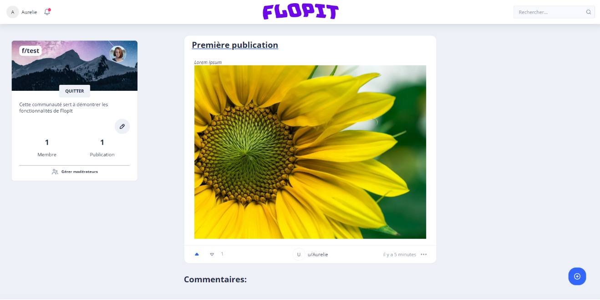
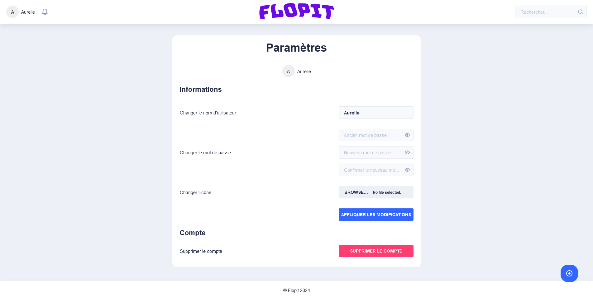

# Table des matières

[Introduction [2](#introduction)](#introduction)

[Accueil [2](#accueil)](#accueil)

[Connexion [3](#connexion)](#connexion)

[Inscription [3](#inscription)](#inscription)

[Accueil authentifié [4](#accueil-authentifié)](#accueil-authentifié)

[Page de recherche [6](#page-de-recherche)](#page-de-recherche)

[Créer une communauté [7](#créer-une-communauté)](#créer-une-communauté)

[Page de communauté [7](#page-de-communauté)](#page-de-communauté)

[Page d’une publication
[11](#page-dune-publication)](#page-dune-publication)

[Messagerie [13](#options-de-modération)](#options-de-modération)

[Paramètres [15](#paramètres)](#paramètres)

# Introduction

FlopIt est une application web qui permet aux utilisateurs de créer et
de joindre des communautés dans lesquelles ils peuvent publier des
publications et des commentaires sur ces publications. FlopIt inclut
aussi plusieurs fonctions d’un média social incluant : la capacité de
voter sur les publications, la possibilité d’envoyer des messages
privés, les notifications en temps réel, un système de modération
disponible pour les modérateurs de communautés et plus encore.

# Accueil

Lorsqu’on ouvre la page principale de FlopIt en n’étant pas connecté à
un compte, voici la page qui s’affiche : une liste des publications avec
la sélection du mode de tri.

Pour chaque publication, en plus du titre (sur lequel on peut cliquer
pour accéder à la page de la publication) et de l’aperçu contenu, on
affiche la communauté à laquelle elle appartient (f/…), son moment de
création ainsi que des boutons « Vote positif » (flèche vers le haut) et
« Vote négatif » (flèche vers le bas) qui permettent aux utilisateurs
connectés (ce que nous ne sommes pas pour l’instant) de voter s’ils
aiment la publication ou non. Chaque utilisateur peut voter une fois sur
une publication (et peut changer son vote) et ce vote sert
principalement au tri des publications. Lorsque vous avez voté sur une
publication, votre vote s’affiche ainsi :

Bien que la grande majorité des pages soit accessible sans être
authentifié (en excluant la page de paramètre, le chat, et la page de
création de communautés), nous allons dès maintenant nous connecter (en
appuyant sur le bouton « Connexion ») pour le reste de ce document afin
de débloquer toutes les interactions, incluant le vote.

# Connexion

Si vous avez déjà un compte, vous pouvez vous connecter avec votre
courriel et votre mot de passe ici. Puisque nous n’avons pas déjà un
compte dans cet exemple, nous allons en créer un en appuyant sur « Pas
de compte ? » ce qui nous amène à la page d’inscription.

# Inscription

En remplissant le formulaire et en appuyant sur « Créer le compte »,
votre compte sera créé et vous serez authentifié et redirigé à la page
d’accueil.

# Accueil authentifié

Voici ce qui est affiché juste après la création d’un compte.

Au milieu en haut de cette page, vous pouvez changer le **mode de tri**
des publications ainsi qu’activer ou désactiver le **mode
« Personnalisé »** ce qui fait en sorte de n’afficher que les
publications de communautés que vous suivez, si vous en suivez (sinon
cela n’a aucun effet).

Vous pouvez toujours appuyer sur le logo « FlopIt » pour retourner à
cette page.

Le thème par défaut avec un compte est le thème sombre. Vous pouvez
changer ce thème (et effectuer d’autres actions) en appuyant sur le nom
du compte, en haut à gauche, ce qui affiche ceci :

Appuyer sur « Basculer thème » pour retourner au thème pâle.

Vous allez aussi remarquer la cloche avec l’**indicateur de
notification**. Appuyer dessus pour afficher ceci :

Vous pouvez maintenant appuyer sur « Activer notifications » pour
activer les notifications « push », ce qui vous avertira lorsqu’un
événement vous concernant arrive (par exemple, quelqu’un écrit un
commentaire sur une de vos publications) même si l’application n’est pas
ouverte.

Vous allez aussi avoir remarqué le **champ de recherche** en haut à
droite de l’écran :

Écrivez dans ce champ pour afficher les utilisateurs et les communautés
correspondantes. Appuyez dessus pour y accéder ou appuyez sur
« Rechercher… » ou sur « Plus… » (pas affiché dans l’exemple précédent)
pour accéder à la page de recherche permettant de faire des recherches
plus en profondeur.

# Page de recherche

Vous pouvez sélectionner la catégorie de recherche en haut
(« Publications », « Commentaires », « Utilisateurs » ou
« Communautés ») et appuyer sur un résultat pour y accéder.

# Créer une communauté

Nous allons maintenant créer une communauté en appuyant sur « Créer une
communauté » dans le menu en haut à gauche (lorsqu’on appuie sur son nom
d’utilisateur). Cela nous amène à la page suivante :

Nous allons remplir le formulaire pour créer une communauté (dans notre
exemple, appelons-la « test » et ne lui donnons pas de description pour
l’instant) et appuyer sur « Créer la communauté », ce qui nous amène sur
la page de la communauté nouvellement créée.

# Page de communauté

Voici ce qui nous est affiché en tant que modérateur de la communauté
vide. Les publications de la communauté s’afficheraient ici et il serait
possible de les trier de la même manière que sur la page d’accueil,
s’ils y en avaient.

Pour accéder à une page de communauté autrement, appuyez sur le nom
d’une communauté quelque part dans l’application (sous une publication,
par exemple) ou utilisez la fonction de recherche.

Dans la section à gauche, vous verrez le bouton « Quitter » pour quitter
la communauté (vous l’avez jointe automatiquement en la créant). Si vous
n’étiez pas déjà membre, le bouton afficherait « Rejoindre ».

Pour modifier la description de la communauté ou ajouter une bannière ou
une icône de communauté, appuyez sur l’icône de crayon dans la section à
gauche, ce qui affichera ceci :

En tant que modérateur de cette communauté, vous pouvez modifier la
description, ajouter une icône en appuyant sur l’icône d’image en haut
et modifier la bannière en appuyant sur l’icône d’image en bas. Une fois
cela fait, appuyer sur l’icône de crochet pour enregistrer ou sur
l’icône X pour annuler. Ajoutons une courte description, une icône et
une bannière :

Vous aurez aussi remarqué le bouton « Gérer modérateurs ». Appuyer
dessus pour afficher ceci :

Cette interface nous permet d’enlever des modérateurs (autres que
nous-mêmes) et d’ajouter des modérateurs en recherchant des utilisateurs
par leur nom d’utilisateur.

Ajoutons l’utilisateur Armel48 comme modérateur en le sélectionnant et
en appuyant sur le bouton avec l’icône « plus » :

On peut fermer les fenêtres avec le bouton X et haut à droite.

Une fois cette interface fermée, on peut s’intéresser au bouton qui est
présent depuis le début en bas à droite de l’écran avec une icône
« plus » :

En appuyant sur ce bouton, l’interface suivante s’ouvre :

Cette interface permet de créer une publication dans une communauté.

Choisissez le titre de votre publication, et la communauté dans laquelle
vous souhaitez publier par son nom dans la liste avec autocomplétions.
Ensuite, entrez le contenu de la publication. Ce contenu peut contenir
du texte riche (avec texte gras, italique, liens, etc.) ainsi que des
images.

Ici, nous allons créer une publication de titre « Première publication »
dans notre communauté « test » avec le contenu « Lorem ipsum » en
italique et une image.

Appuyez sur « Publier » pour publier la publication. Vous serez redirigé
vers la page de la publication.

# Page d’une publication

Ici, il est possible de lire et d’écrire des commentaires sur la
publication.

Vous remarquerez que lorsqu’on crée une publication ou un commentaire,
un vote positif y est automatiquement appliqué de notre part.

En tant qu’auteur de la publication (et modérateur de la communauté),
vous avez accès à quelques fonctions supplémentaires. Appuyez sur le
bouton en bas à droite de la publication, ce qui, dans notre cas,
affichera les fonctions suivantes :

Il est possible pour nous de modifier la publication (avec
essentiellement la même interface que pour la création de la
publication), de la supprimer ou d’y répondre par un commentaire.
Appuyons sur le bouton « Répondre » pour écrire un commentaire.
L’interface suivante s’ouvrira :

Écrivons le contenu du commentaire de la même façon que pour la
publication et appuyons sur « Publier ». L’interface sera mise à jour
avec le nouveau commentaire :

# Options de modération

De retour à la page de notre communauté, il semble que quelqu’un a
laissé une publication contenant des propos déplacés dans la communauté
que vous avez créée.

En appuyant sur le titre de la publication (« womp womp ») que l’on
désire supprimer, on se rend à la page pour cette publication où l’on
peut appuyer sur le bouton en bas à droite pour afficher les fonctions
pour cette publication.

Ici, nous pouvons faire d’une pierre deux coups en supprimant la
publication et en bannissant l’utilisateur avec la même option : le menu
présenté offre l’option facultative de bannir l’auteur de la publication
ou du commentaire en spécifiant un temps d’expiration et une raison pour
le bannissement.

Une fois confirmé, le contenu de la publication sera détruit afin
d’éliminer tout propos inapproprié. Si applicable, l’utilisateur sera
notifié du bannissement, de la raison et de l’expiration de celui-ci et
il sera à présent impossible pour lui de continuer à contribuer à votre
communauté.

# Messagerie

Passons maintenant à la fonctionnalité de messagerie de l’application,
ou *chat*. Retournons dans le menu utilisateur en appuyant sur notre nom
utilisateur en haut à droite et sélectionnons l’option « *Chat* ».

La page suivante s’affiche :

Vos conversations s’affichent à gauche (il n’y en a aucune pour
l’instant) et les messages de la conversation active seront à droite.

Créons une conversation. Appuyez sur le bouton avec une icône « plus »
ou appuyez sur un nom d’utilisateur un peu partout dans l’application
pour afficher l’interface suivant :

Sélectionnez un utilisateur et écrivez-lui un message pour amorcer la
conversation. En appuyant sur le bouton d’envoi (avec l’icône d’avion en
papier), la conversation sera créée :

En bas à droite, se trouvera le champ pour écrire un nouveau message, si
vous avez une conversation active.

Les messages de l’autre utilisateur s’afficheront ainsi :

# Paramètres 

Il ne nous reste maintenant qu’une fonctionnalité importante de FlopIt à
expliquer : la page de paramètres.

Ouvrez la page de paramètres en appuyant sur ce bouton :

La page s’affichera ainsi :

Cette page vous permet de changer votre nom d’utilisateur, votre mot de
passe ou votre avatar en changeant les champs appropriés et en appuyant
sur « Appliquer les modifications ».

De plus, vous pouvez supprimer votre compte en appuyant sur « Supprimer
le compte » et en appuyant ensuite sur « Oui » dans la fenêtre de
confirmation qui s’affichera.

Si vous voulez simplement vous déconnecter, appuyez sur le bouton
« Déconnexion », disponible en tout temps :

